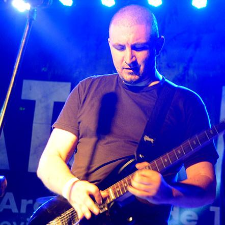

<!DOCTYPE html>
<html lang="en">
  <head>
    <meta http-equiv="content-type" content="text/html; charset=utf-8">
    <meta name="viewport" content="width=device-width, initial-scale=1, shrink-to-fit=no">
    <meta name="description" content="">
    <meta name="author" content="">
    <title>Poch - pagina personal</title>
    <link rel="icon" type="image/x-icon" href="assets/img/POCH.jpg">
    <!-- Font Awesome icons (free version)-->
    
    <!-- Google fonts-->
    <link href="https://fonts.googleapis.com/css?family=Saira+Extra+Condensed:500,700"

      rel="stylesheet" type="text/css">
    <link href="https://fonts.googleapis.com/css?family=Muli:400,400i,800,800i"

      rel="stylesheet" type="text/css">
    <!-- Core theme CSS (includes Bootstrap)-->
    <link href="css/styles.css" rel="stylesheet">
  </head>
  <body id="page-top">
    <!-- Navigation-->
    <nav class="navbar navbar-expand-lg navbar-dark bg-primary fixed-top" id="sideNav">
      <a class="navbar-brand js-scroll-trigger" href="#page-top"> Matías
          Poch  </a> <button class="navbar-toggler"

        type="button" data-toggle="collapse" data-target="#navbarSupportedContent"

        aria-controls="navbarSupportedContent" aria-expanded="false" aria-label="Toggle navigation"></button>
      

        <ul class="navbar-nav">
          <li class="nav-item"><a class="nav-link js-scroll-trigger" href="#about">inico</a></li>
          <li class="nav-item">
            <address><a class="nav-link js-scroll-trigger" href="#experience">servidor
                de video personal</a> <a class="nav-link js-scroll-trigger" href="#education">un
                server para aprender jugando</a></address>
          </li>
          <li class="nav-item"><a class="nav-link js-scroll-trigger" href="#skills">nube
              personal</a></li>
          <li class="nav-item"><a class="nav-link js-scroll-trigger" href="#interests">equipo</a></li>
          <li class="nav-item"><a class="nav-link js-scroll-trigger" href="#awards">musica</a></li>
        </ul>
      

    </nav>
    <!-- Page Content-->
    

      <!-- About-->
      <section class="resume-section" id="about">
        

          <h1 class="mb-0"> Matías Poch </h1>
          
. 

          
Esta pagina personal es una herramienta donde
            agrupo algunos de mis proyectos

          
 
          

          
&nbsp; <a class="social-icon" href="#"><i class="fab fa-github"></i></a>
            <a class="social-icon" href="#"><i class="fab fa-twitter"></i></a> <a

              class="social-icon" href="#"><i class="fab fa-facebook-f"></i></a><a

              class="social-icon" href="#"><i class="fab fa-linkedin-in"></i></a>
            
 

      </section>
      

      <!-- Experience-->
      <section class="resume-section" id="experience">
        

          <h2 class="mb-5">proyectos</h2>
          

            

              <h3 class="mb-0">servidor de video personal</h3>
              
mi netflix familiar

              
Este
                  sistema me permite alojar y publicar películas, series,
                  canales de tv, música y videos personales. también puedo crear
                  cuentas para distintos usuarios y administrar el contenido
                  disponible para cada uno.

              

            

            
 
              

          

        

      </section>
      

      <!-- Education-->
      <section class="resume-section" id="education">
        

          <h3 class="mb-0">servidor multiservicios</h3>
          
un lugar donde jugar

          En una umilde y vieja pc con linux y docker aprendo jugando, aca la
          interface de acceso
          

          

        

      </section>
      

      <!-- Skills-->
      <section class="resume-section" id="skills">
        

          <h3 class="mb-0">nube personal</h3>
          
toda una caja de herramientas

          En el umilde servidor un puñado de herramientas forman mi nube
          personal, con backup de archivos, administracion de usuarios,
          comparticion de archivos, cargas publicas y cositas de esas que se van
          sumando.
          
 
          

          
 
          

          

        

      </section>
      

      <!-- Interests-->
      <section class="resume-section" id="interests">
        

          <h2 class="mb-5">equuipo</h2>
          
Actualmente formo parte de equipo de la cadena de canales SOMOS de
            la empresa TELECOM Argentina, como referente técnico y supervisor de
            control de estudio y control central de emisión.

          
Es un gusto formar parte de este proyecto y sumar todos los días en
            equipo.

          
&nbsp;&nbsp;&nbsp;&nbsp;&nbsp;&nbsp;
            

          
 
          

        

      </section>
      

      <!-- Awards-->
      <section class="resume-section" id="awards">
        

          <h2 class="mb-5">proyecto musical</h2>
          
Durante años la musica fue una pata fundamental en mi vida, durante
            más de 10 años formando parte de la banda EXPRESO ROCK y grabando
            como cesionista.

          
En la actualidad y desde hace años formo parte de la banda E.A.H.
            (Estamos Al Horno) pasando por géneros desde el blues hasta el hard
            rock.

          
Acá las redes de la banda.

          
&nbsp;&nbsp;&nbsp;&nbsp;
            &nbsp;&nbsp;&nbsp;
            

          <ul class="fa-ul mb-0">
          </ul>
        

      </section>
    

    <!-- Bootstrap core JS-->
    
    
    <!-- Third party plugin JS-->
    
    <!-- Core theme JS-->
    
  </body>
</html>

